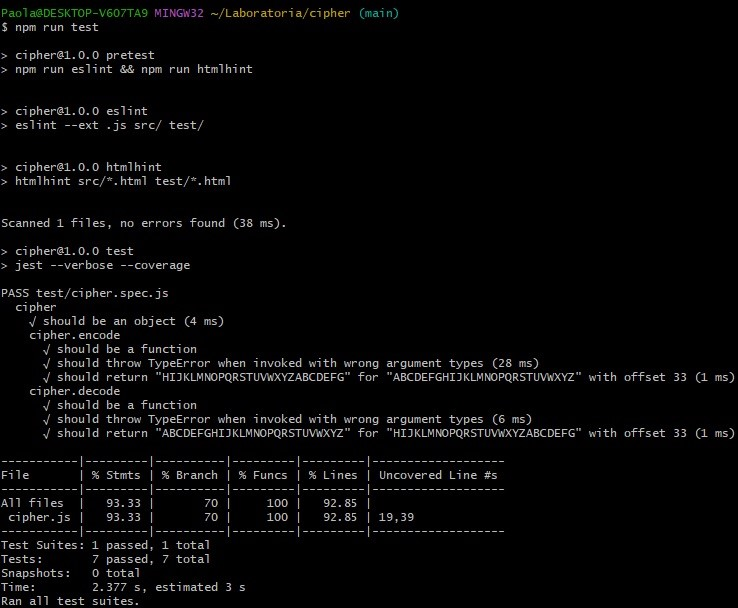
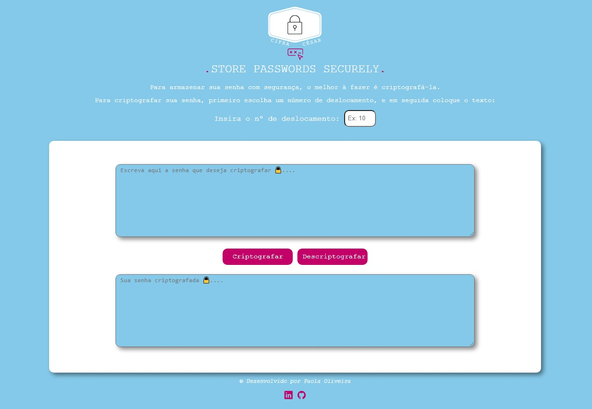

# Cifra de César

***

## 1. Prefácio

Cifrar significa codificar. A [cifra de César](https://pt.wikipedia.org/wiki/Cifra_de_C%C3%A9sar)
é um dos primeiros tipos de criptografias conhecidas na história.
O imperador romano Júlio César utilizava essa cifra para enviar
ordens secretas aos seus generais no campo de batalha.

A cifra de César é uma das técnicas mais simples de cifrar uma mensagem. É um
tipo de cifra por substituição, em que cada letra do texto original é
substituida por outra que se encontra há um número fixo de posições
(deslocamento) mais a frente do mesmo alfabeto.

Por exemplo se usarmos o deslocamento (_offset_) de 3 posições:

* Alfabeto sem cifrar: A B C D E F G H I J K L M N O P Q R S T U V W X Y Z
* Alfabeto com cifra:  D E F G H I J K L M N O P Q R S T U V W X Y Z A B C
* A letra A será D
* A palavra CASA será FDVD

Atualmente todas as cifras de substituição alfabética simples, são decifradas
com facilidade e não oferecem muita segurança na comunicação por si mesma,
mas a cifra de César muitas vezes pode fazer parte de um sistema
mais complexo de criptografia, como
a cifra de Vigenère, e tem aplicação no sistema ROT13.

## 2. Resumo do projeto

Neste projeto foi criado a primeira aplicação web do _bootcamp_. Nela o usuário
poderá cifrar e decifrar um texto no navegador indicando um deslocamento
específico de caracteres (_offset_). 

O projeto, tem como objetivo, permitir que os usuários salvem suas senhas de forma segura. 

### Os objetivos gerais deste projeto são os seguintes

* Trabalhar com base em um boilerplate, a estrutura básica de um projeto em diferentes
  pastas (através de módulos em JS).
* Conhecer as ferramentas de manutenção e melhoria do código (linters e testes
  unitários).
* Aprenda sobre objetos, estruturas, métodos e iteração (loops) em JavaScript
* Implementar controle de versão com git (e a plataforma github)

## 3. Como usar

Para usar o .STORE PASSWORDS SECURELY., basta selecionar um número de deslocamento, sendo permitido números positivos e negativos,  digitar sua senha no primeiro campo e clicar no botão "Criptografar" e você verá a mensagem criptografada no campo logo abaixo. 
Para descriptografar basta informar o deslocamento (deve ser o mesmo utilizado na hora de Cifrar), colar a senha criptografada no primeiro campo e clicar no botão "Descriptografar" e o resultado será mostrado no campo abaixo.

## 4. Protótipo do Projeto

Esses são os requisitos atendidos pelo projeto.

**1. Uma interface que deve permitir ao usuário:**

* **Criptografar uma mensagem**
  - Inserir a mensagem (texto) que deseja criptografar. A mensagem usa um
    alfabeto simplificado (apenas letras maiúsculas).
  - Escolher um número de deslocamento (_offset_) indicando quantas posições
    você deseja que a cifra desloque cada caractere do alfabeto. O número
    será positivo e inteiro (inteiro positivo).
  - Veja o resultado da mensagem criptografada.

* **Descriptografar uma mensagem**
  - Inserir a mensagem (texto) que deseja descriptografar. A mensagem usa um
    alfabeto simplificado (apenas letras maiúsculas).
  - Escolher um número de deslocamento (_offset_, que corresponde ao que usamos
    para criptografar) indicando quantas posições você deseja que a cifra
    desloque cada caractere do alfabeto. O número será positivo e inteiro
    (inteiro positivo).
  - Veja o resultado da mensagem descriptografada.

  Após pensar em um tema, foi realizado um protótipo no Excalidraw

  

**2. Testes unitários dos métodos.**

Os métodos `cipher` (`encode` e `decode`) devem ser cobertos por testes
unitários.

Testes realizados com sucesso ✔️

**3. Código do seu projeto enviado para seu repositório e interface "implantada".**
O código final deve estar um repositório no GitHub. A interface, ou página da
web, deve ser "implantada" usando o GitHub Pages.

**4. Resultado**

## 5. Objetivos alcançados

Em resumo, os critérios mínimos de aceitação do projeto para considerar o
Project Feedback:

* [✔️] Possui uma interface que permite ao usuário criptografar e
  descriptografar.
* [✔️] Possibilidade de escolha do Offset (deslocamento) pelo usuário.
* [✔️] Interface onde o usuário digite a mensagem desejada.
* [✔️] Interface para visualização do resultado da cifra.
* [✔️] Alerta caso o campo de deslocamento não for preenchido.
* [✔️] Cifrar/Decifrar letras maiúculas/minúsculas.
* [✔️] Suporte para caracteres especiais e números: são mantidos.
* [✔️] O projeto será entregue incluindo testes unitários dos métodos `cipher`
  (`encode` e `decode`).
* [✔️] O projeto será entregue livre de _erros_ de `eslint` (_warnings_ são ok).
* [✔️] O código do seu projeto será entregue no GitHub.
* [✔️] A interface será "implantada" usando o GitHub Pages.
* [✔️] O README contém uma definição de produto.
